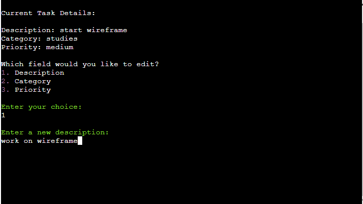
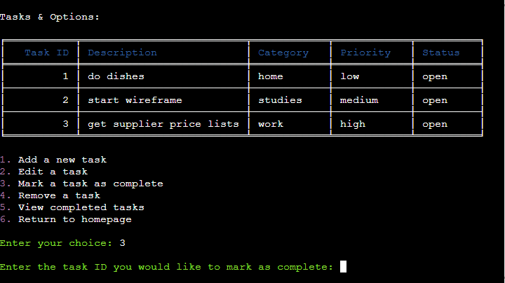
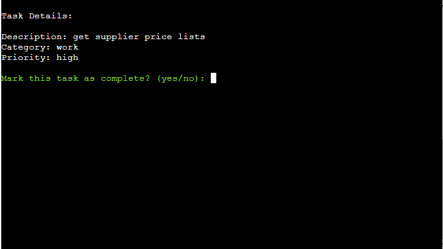
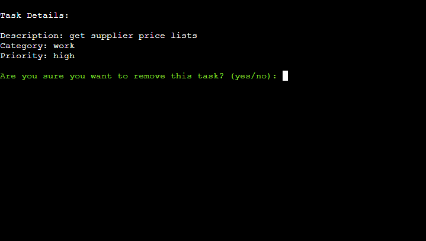
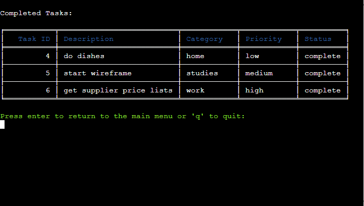

# Tidy Tasks
Welcome to Tidy Tasks, a personal to-do list app built with Python and Google Sheets.

## Introduction
Tidy Tasks is designed to help you keep track of your to-dos by adding, editing removing and marking tasks as complete.

## Live App
The live Tidy Tasks app can be found [here](https://tidy-tasks-9ed489f18853.herokuapp.com/).

## Table of Contents

## User Experience (UX)
### Who Tidy Tasks Caters For
- Tidy Tasks is designed for anyone who wants to keep track of their to-dos. It is designed to be simple and easy to use, with a minimal homepage and a clean interface.
- Whether you're a busy parent, a student, or a professional, Tidy Tasks can help you keep track of your tasks.

### User Stories
| User Want or Need      | How It Is Achieved | Achieved |
| ----------- | ----------- | ----------- |
| Easily see what Tidy tasks is for      | An About section provides information about Tidy Tasks and what the user can achieve       | Yes       |
| Navigate the app with ease      | Numbered options with clear details present throughout       | Yes       |
| Manage tasks in one place     | A view and manage tasks section present with options for managing and viewing tasks       | Yes       |
| Add tasks easily     | A form with a text input and submit button is present       | Yes       |

## Planning
### Flowchart / Diagram

### Concept
- The concept for Tidy Tasks was to create a simple, easy to use to-do list app that allows the user to add, edit, remove and mark tasks as complete.
- The app is designed to be personalized and offers a minimal layout and a clean interface.
- Being able to access to the app from anywhere was also a key concept, which is why the app is hosted on Heroku and uses Google Sheets as a database.
- Accessing all of your tasks in one place and being able to manage them with ease was also a key concept, which is why the app allows the user to view and manage their tasks with the click of a button.

### Color Scheme & Ascii Art
#### Color Scheme
- The colors throughout the application are kept minimal to ensure all text is easily readable.
- The ascii art is magenta to add a splash of color to the homepage and about page.
- Throughout the application, majority of the text is white on a black background.
- Menu options are magenta and table headers are blue to stand out from the rest of the text.
- Text inputs / prompts are green to ensure the user can easily identify where to input text.
- Error messages are red to ensure the user can easily identify when an error has occurred and successfully completed operations are green for user confirmation.

#### Ascii Art
- Homepage Ascii Art
    
    

- About Ascii Art
    
    

## Features
### Existing Features
#### Homepage
- The homepage is minimal, inviting the user to navigate the app.
- Pops of color are used to draw the user's attention to the menu options and input.

      
##### Menu Options
1. View & Manage Tasks - This allows the user to view and manage their tasks.
2. About - This provides the user with information about Tidy Tasks.
3. Exit - This allows the user to exit the application and provides confirmation once selected.

#### View & Manage Tasks Menu
- By selecting option 1 from the homepage, the user is presented with the view and manage tasks menu.
- The user is presented with a table / list of their open tasks and a menu of options to manage their tasks.
- This differs from the flowchart in that viewing the list of tasks was originally intended to be one of the menu options. This change was implemented to make it easier for the user as they can now view their tasks without having to select an option from the menu and can see the different options available while viewing their open tasks.

    

#### Add Task
- By selecting option 1 from the view and manage tasks menu, the user is guided through the process of adding a task.
- The user is prompted to enter a task description, category and priority.
- To ensure a smooth user experience, the user is prompted to enter a category (home, studies, work, exercise, hobbies) and priority (low, medium, high) based on a list of options. This was implemented to speed up the process of adding a task and to ensure the table / list of tasks is consistent and easy to read.

    
- Once the user has entered a task description, category and priority, they are presented with the task details entered and prompted to confirm the addition of the task.
    
- If the user confirms the addition of the task, they are presented with a success message, the task is added to the spreadsheet and the user is returned to the view and manage tasks menu.
- The task ID / number is automatically generated and assigned to the task based on the number of tasks in the spreadsheet. This was implemented to ensure the task ID / number is unique and to ensure the user does not have to enter a task ID / number when adding a task.
- If the user does not confirm the addition of the task, they are presented with a message confirming the task was not added and are given the option to re-enter the task details. If the user chooses to re-enter the task details, they are returned to the add task prompt, but if they choose not to re-enter the task details, they are returned to the view and manage tasks menu.

#### Edit Task
- By selecting option 2 from the view and manage tasks menu, the user is guided through the process of editing a task.
- The table / list of tasks remains visible to the user while they are editing a task to ensure they can easily identify the task they wish to edit.
- The user is prompted to enter the task ID / number of the task they wish to edit.

    
- If the user enters an invalid task ID / number, they are presented with an error message and prompted to try again.
- If the user selects a valid task ID / number, they are presented with the task details and prompted to confirm which field they wish to edit.

    
- After the user has selected the field they wish to edit, they are prompted to enter the new value for the field.
- Confirmation of the updated task details is presented to the user and they are prompted to confirm the update.

    
- If the user confirms the updated task details, they are presented with a success message, the task is edited in the spreadsheet and the user is returned to the view and manage tasks menu.
- If the user does not confirm the updated task details, they are presented with a message confirming the changes were not saved and are given the option to re-enter the task details. If the user chooses to re-enter the task details, they are returned to the edit task prompt, but if they choose not to re-enter the task details, they are returned to the view and manage tasks menu.

#### Mark Task as Complete
- By selecting option 3 from the view and manage tasks menu, the user is guided through the process of marking a task as complete.
- The table / list of tasks remains visible to the user while they are marking a task as complete to ensure they can easily identify the task they wish to mark as complete.
- The user is prompted to enter the task ID / number of the task they wish to mark as complete.

    
- If the user enters an invalid task ID / number, they are presented with an error message and prompted to try again.
    
- If the user selects a valid task ID / number, they are presented with the task details and prompted to confirm marking the task as complete.

    
- If the user confirms marking the task as complete, they are presented with a success message, the task is marked as complete in the spreadsheet and the user is returned to the view and manage tasks menu.
- If the user does not confirm marking the task as complete, they are presented with a message confirming the task was not marked as complete and the user is returned to the view and manage tasks menu.

#### Remove Task
- By selecting option 4 from the view and manage tasks menu, the user is guided through the process of removing a task.
- The table / list of tasks remains visible to the user while they are removing a task to ensure they can easily identify the task they wish to remove.
- The user is prompted to enter the task ID / number of the task they wish to remove.

    
- If the user enters an invalid task ID / number, they are presented with an error message and prompted to try again.

    
- If the user selects a valid task ID / number, they are presented with the task details and prompted to confirm removing the task.

    
- If the user confirms removing the task, they are presented with a success message, the task is removed from the spreadsheet and the user is returned to the view and manage tasks menu.
- If the user does not confirm removing the task, they are presented with a message confirming the task was not removed and the user is returned to the view and manage tasks menu.

#### View Completed Tasks
- By selecting option 5 from the view and manage tasks menu, the user is presented with a table / list of their completed tasks.
- The user is given the option to return to the view and manage tasks menu or exit the application.

    

#### About
- By selecting option 2 from the homepage, the user is presented with information about Tidy Tasks.
- This includes a description of Tidy Tasks and a list of features.

    
- The user is given the option to return to the homepage or exit the application.

### Future Features to Implement
- **Add Options to Completed Tasks** - Add the option to edit and re-open completed tasks.
- **Search & Sort Tasks** - Add the option to search and sort tasks by task ID / number, task description, category and priority.
- **Task Pages** - Adjust the view and manage tasks menu to display a maximum amount of tasks per page and add the option to navigate between pages.
- **Refactor Code** - Refactor the code to make it more efficient and even easier to read.

## Testing
### Manual Testing
#### Test 1: Homepage Navigation

| Step | Action | Expected Outcome | Pass/Fail |
|------|--------|------------------|-----------|
| 1 | Open the application. | The user is presented with the homepage & prompted to select an option from the menu. | Pass |
| 2 | The user selects option 1. | The user is taken to the view and manage tasks menu. | Pass |
| 3 | The user selects option 6 from the view and manage tasks menu. | The user is taken to the homepage. | Pass |
| 4 | The user selects option 2. | The user is taken to the about page. | Pass |
| 5 | The user presses enter on the about page. | The user is taken to the homepage. | Pass |
| 6 | The user selects option 3. | The user is presented with a confirmation message and the application is exited. | Pass |

#### Test 2: Homepage - Error Handling
| Step | Action | Expected Outcome | Pass/Fail |
|------|--------|------------------|-----------|
| 1 | Open the application. | The user is presented with the homepage & prompted to select an option from the menu. | Pass |
| 2 | The user inputs an invalid option. | The user is presented with an error message and prompted to try again. | Pass |

#### Test 3: View & Manage Tasks Menu
| Step | Action | Expected Outcome | Pass/Fail |
|------|--------|------------------|-----------|
| 1 | Open the application. | The user is presented with the homepage & prompted to select an option from the menu. | Pass |
| 2 | The user selects option 1 from the homepage. | The user is presented with a table / list of their open tasks and a menu of options to manage their tasks. | Pass |
| 3 | The user selects option 1 from the view and manage tasks menu. | The user is taken to the add task prompt. | Pass |
| 4 | The user selects option 2 from the view and manage tasks menu. | The user is taken to the edit task prompt. | Pass |
| 5 | The user selects option 3 from the view and manage tasks menu. | The user is taken to the mark task as complete prompt. | Pass |
| 6 | The user selects option 4 from the view and manage tasks menu. | The user is taken to the remove task prompt. | Pass |
| 7 | The user selects option 5 from the view and manage tasks menu. | The user is taken to the view completed tasks prompt. | Pass |
| 8 | The user selects option 6 from the view and manage tasks menu. | The user is taken to the homepage. | Pass |

#### Test 4: View & Manage Tasks Menu - Error Handling
| Step | Action | Expected Outcome | Pass/Fail |
|------|--------|------------------|-----------|
| 1 | Open the application. | The user is presented with the homepage & prompted to select an option from the menu. | Pass |
| 2 | The user selects option 1 from the homepage. | The user is presented with a table / list of their open tasks and a menu of options to manage their tasks. | Pass |
| 3 | The user inputs an invalid option. | The user is presented with an error message and prompted to try again. | Pass |

#### Test 5: Add Task
| Step | Action | Expected Outcome | Pass/Fail |
|------|--------|------------------|-----------|
| 1 | Open the application. | The user is presented with the homepage & prompted to select an option from the menu. | Pass |
| 2 | The user selects option 1 from the homepage. | The user is presented with a table / list of their open tasks and a menu of options to manage their tasks. | Pass |
| 3 | The user selects option 1 from the view and manage tasks menu. | The user is taken to the add task prompt. | Pass |
| 4 | The user is prompted to enter a task description. | The user enters a task description & is taken to the next step. | Pass |
| 5 | The user is prompted to enter a category. | The user enters a category & is taken to the next step. | Pass |
| 6 | The user is prompted to enter a priority. | The user enters a priority & is taken to the next step. | Pass |
| 7 | The user is presented with the task details entered and prompted to confirm the addition of the task. | The user confirms the addition of the task, is presented with a success message, the task is added to the spreadsheet and the user is returned to the view and manage tasks menu. | Pass |
| 8 | Instead of confirming the addition of the task, the user selects no. | The user is presented with a message confirming the task was not added and is given the option to re-enter the task details. | Pass |
| 9 | The user selects yes when prompted to re-enter the task details. | The user is returned to the add task prompt. | Pass |
| 10 | The user selects no when prompted to re-enter the task details. | The user is returned to the view and manage tasks menu. | Pass |

#### Test 6: Add Task - Error Handling
| Step | Action | Expected Outcome | Pass/Fail |
|------|--------|------------------|-----------|
| 1 | Open the application. | The user is presented with the homepage & prompted to select an option from the menu. | Pass |
| 2 | The user selects option 1 from the homepage. | The user is presented with a table / list of their open tasks and a menu of options to manage their tasks. | Pass |
| 3 | The user selects option 1 from the view and manage tasks menu. | The user is taken to the add task prompt. | Pass |
| 4 | The user attempts to add a task without entering a task description. | The user is presented with an error message and prompted to try again. | Pass |
| 5 | The user attempts to add a description that exceeds the maximum character limit. | The user is presented with an error message and prompted to try again. | Pass |
| 6 | The user enters a valid task description. | The user is prompted to enter a category. | Pass |
| 7 | The user attempts to add a task without entering a category. | The user is presented with an error message and prompted to try again. | Pass |
| 8 | The user attempts to add an invalid category. | The user is presented with an error message and prompted to try again. | Pass |
| 9 | The user enters a valid category. | The user is prompted to enter a priority. | Pass |
| 10 | The user attempts to add a task without entering a priority. | The user is presented with an error message and prompted to try again. | Pass |
| 11 | The user attempts to add an invalid priority. | The user is presented with an error message and prompted to try again. | Pass |
| 12 | The user enters a valid priority. | The user is presented with the task details entered and prompted to confirm the addition of the task. | Pass |
| 13 | The user attempts to confirm the addition of the task without selecting an option. | The user is presented with an error message and prompted to try again. | Pass |
| 14 | The user attempts to confirm the addition of the task by selecting an invalid option. | The user is presented with an error message and prompted to try again. | Pass |
| 15 | The user confirms the addition of the task. | The user is presented with a success message, the task is added to the spreadsheet and the user is returned to the view and manage tasks menu. | Pass |
| 16 | Instead of confirming the addition of the task, the user selects no. | The user is presented with a message confirming the task was not added and is given the option to re-enter the task details. | Pass |
| 17 | The user presses enter without selecting an option. | The user is presented with an error message and prompted to try again. | Pass |
| 18 | The user selects an invalid option. | The user is presented with an error message and prompted to try again. | Pass |
| 19 | The user selects yes when prompted to re-enter the task details. | The user is returned to the add task prompt. | Pass |
| 20 | The user selects no when prompted to re-enter the task details. | The user is returned to the view and manage tasks menu. | Pass |

#### Test 7: Edit Task
| Step | Action | Expected Outcome | Pass/Fail |
|------|--------|------------------|-----------|
| 1 | Open the application. | The user is presented with the homepage & prompted to select an option from the menu. | Pass |
| 2 | The user selects option 1 from the homepage. | The user is presented with a table / list of their open tasks and a menu of options to manage their tasks. | Pass |
| 3 | The user selects option 2 from the view and manage tasks menu. | The user is taken to the edit task prompt. | Pass |
| 4 | The user is prompted to enter a task ID / number. | The user enters a task ID / number & is taken to the next step. | Pass |
| 5 | The user is presented with the task details and prompted to confirm which field they wish to edit. | The user selects an option & is taken to the next step. | Pass |
| 6 | The user is prompted to enter the new value for the field. | The user enters a new value & is taken to the next step. | Pass |
| 7 | The user is presented with the updated task details and prompted to confirm the update. | The user confirms the update, is presented with a success message, the task is edited in the spreadsheet and the user is presented with an option to return to the view and manage tasks menu or exit the application. | Pass |
| 8 | The user presses enter. | The user is returned to the view and manage tasks menu. | Pass |
| 9 | The user presses q. | The user is presented with a confirmation message and the application is exited. | Pass |
| 10 | Instead of confirming the update, the user selects no. | The user is presented with a message confirming the changes were not saved and is given the option to re-enter the task details. | Pass |
| 11 | The user selects yes when prompted to re-enter the task details. | The user is returned to the edit task prompt. | Pass |
| 12 | The user selects no when prompted to re-enter the task details. | The user is returned to the view and manage tasks menu. | Pass |

#### Test 8: Edit Task - Error Handling
| Step | Action | Expected Outcome | Pass/Fail |
|------|--------|------------------|-----------|
| 1 | Open the application. | The user is presented with the homepage & prompted to select an option from the menu. | Pass |
| 2 | The user selects option 1 from the homepage. | The user is presented with a table / list of their open tasks and a menu of options to manage their tasks. | Pass |
| 3 | The user selects option 2 from the view and manage tasks menu. | The user is taken to the edit task prompt. | Pass |
| 4 | The user attempts to edit a task without entering a task ID / number. | The user is presented with an error message and prompted to try again. | Pass |
| 5 | The user attempts to edit a task with an invalid task ID / number. | The user is presented with an error message and prompted to try again. | Pass |
| 6 | The user enters a valid task ID / number. | The user is presented with the task details and prompted to confirm which field they wish to edit. | Pass |
| 7 | The user attempts to confirm which field they wish to edit without selecting an option. | The user is presented with an error message and prompted to try again. | Pass |
| 8 | The user attempts to confirm which field they wish to edit by selecting an invalid option. | The user is presented with an error message and prompted to try again. | Pass |
| 9 | The user selects option 1. | The user is prompted to enter the new value for the description field. | Pass |
| 10 | The user attempts to confirm the update without entering a new value. | The user is presented with an error message and prompted to try again. | Pass |
| 11 | The user attempts to confirm the update with a new value that exceeds the maximum character limit. | The user is presented with an error message and prompted to try again. | Pass |
| 12 | The user enters a valid new value. | The user is presented with the updated task details and prompted to confirm the update. | Pass |
| 13 | The user attempts to confirm the update without selecting an option. | The user is presented with an error message and prompted to try again. | Pass |
| 14 | The user attempts to confirm the update by selecting an invalid option. | The user is presented with an error message and prompted to try again. | Pass |
| 15 | The user confirms the update. | The user is presented with a success message, the task is edited in the spreadsheet and the user is presented with an option to return to the view and manage tasks menu or exit the application. | Pass |
| 16 | The user presses enter. | The user is returned to the view and manage tasks menu. | Pass |
| 17 | The user presses q. | The user is presented with a confirmation message and the application is exited. | Pass |
| 18 | Instead of confirming the update, the user selects no. | The user is presented with a message confirming the changes were not saved and is given the option to re-enter the task details. | Pass |
| 19 | The user selects yes when prompted to re-enter the task details. | The user is returned to the edit task prompt. | Pass |
| 20 | The user selects no when prompted to re-enter the task details. | The user is returned to the view and manage tasks menu. | Pass |

#### Test 9: Mark Task as Complete
| Step | Action | Expected Outcome | Pass/Fail |
|------|--------|------------------|-----------|
| 1 | Open the application. | The user is presented with the homepage & prompted to select an option from the menu. | Pass |
| 2 | The user selects option 1 from the homepage. | The user is presented with a table / list of their open tasks and a menu of options to manage their tasks. | Pass |
| 3 | The user selects option 3 from the view and manage tasks menu. | The user is taken to the mark task as complete prompt. | Pass |
| 4 | The user is prompted to enter a task ID / number. | The user enters a task ID / number & is taken to the next step. | Pass |
| 5 | The user is presented with the task details, is prompted to confirm marking the task as complete and selects yes. | The user is presented with a success message, the task is marked as complete and the user is presented with an option to return to the view and manage tasks menu or exit the application. | Pass |
| 6 | The user presses enter. | The user is returned to the view and manage tasks menu. | Pass |
| 7 | The user presses q. | The user is presented with a confirmation message and the application is exited. | Pass |
| 8 | Instead of confirming marking the task as complete, the user selects no. | The user is presented with a message confirming the task was not marked as complete and the user is returned to the view and manage tasks menu. | Pass |

#### Test 10: Mark Task as Complete - Error Handling
| Step | Action | Expected Outcome | Pass/Fail |
|------|--------|------------------|-----------|
| 1 | Open the application. | The user is presented with the homepage & prompted to select an option from the menu. | Pass |
| 2 | The user selects option 1 from the homepage. | The user is presented with a table / list of their open tasks and a menu of options to manage their tasks. | Pass |
| 3 | The user selects option 3 from the view and manage tasks menu. | The user is taken to the mark task as complete prompt. | Pass |
| 4 | The user attempts to mark a task as complete without entering a task ID / number. | The user is presented with an error message and prompted to try again. | Pass |
| 5 | The user attempts to mark a task as complete with an invalid task ID / number. | The user is presented with an error message and prompted to try again. | Pass |
| 6 | The user enters a valid task ID / number. | The user is presented with the task details and is prompted to confirm marking the task as complete. | Pass |
| 7 | The user attempts to confirm marking the task as complete without selecting an option. | The user is presented with an error message and prompted to try again. | Pass |
| 8 | The user attempts to confirm marking the task as complete by selecting an invalid option. | The user is presented with an error message and prompted to try again. | Pass |
| 9 | The user confirms marking the task as complete. | The user is presented with a success message, the task is marked as complete and the user is presented with an option to return to the view and manage tasks menu or exit the application. | Pass |
| 10 | The user presses enter. | The user is returned to the view and manage tasks menu. | Pass |
| 11 | The user presses q. | The user is presented with a confirmation message and the application is exited. | Pass |
| 12 | Instead of confirming marking the task as complete, the user selects no. | The user is presented with a message confirming the task was not marked as complete and the user is returned to the view and manage tasks menu. | Pass |

#### Test 11: Remove Task
| Step | Action | Expected Outcome | Pass/Fail |
|------|--------|------------------|-----------|
| 1 | Open the application. | The user is presented with the homepage & prompted to select an option from the menu. | Pass |
| 2 | The user selects option 1 from the homepage. | The user is presented with a table / list of their open tasks and a menu of options to manage their tasks. | Pass |
| 3 | The user selects option 4 from the view and manage tasks menu. | The user is taken to the remove task prompt. | Pass |
| 4 | The user is prompted to enter a task ID / number and enters a valid task ID / number. | The user is presented with the task details, is prompted to confirm removing the task and selects yes. | Pass |
| 5 | The user selects yes. | The user is presented with a success message, the task is removed from the spreadsheet and the user is presented with an option to return to the view and manage tasks menu or exit the application. | Pass |
| 6 | The user presses enter. | The user is returned to the view and manage tasks menu. | Pass |
| 7 | The user presses q. | The user is presented with a confirmation message and the application is exited. | Pass |
| 8 | Instead of confirming removing the task, the user selects no. | The user is presented with a message confirming the task was not removed and the user is returned to the view and manage tasks menu. | Pass |

#### Test 12: Remove Task - Error Handling
| Step | Action | Expected Outcome | Pass/Fail |
|------|--------|------------------|-----------|
| 1 | Open the application. | The user is presented with the homepage & prompted to select an option from the menu. | Pass |
| 2 | The user selects option 1 from the homepage. | The user is presented with a table / list of their open tasks and a menu of options to manage their tasks. | Pass |
| 3 | The user selects option 4 from the view and manage tasks menu. | The user is taken to the remove task prompt. | Pass |
| 4 | The user attempts to remove a task without entering a task ID / number. | The user is presented with an error message and prompted to try again. | Pass |
| 5 | The user attempts to remove a task with an invalid task ID / number. | The user is presented with an error message and prompted to try again. | Pass |
| 6 | The user enters a valid task ID / number. | The user is presented with the task details and is prompted to confirm removing the task. | Pass |
| 7 | The user attempts to confirm removing the task without selecting an option. | The user is presented with an error message and prompted to try again. | Pass |
| 8 | The user attempts to confirm removing the task by selecting an invalid option. | The user is presented with an error message and prompted to try again. | Pass |
| 9 | The user confirms removing the task. | The user is presented with a success message, the task is removed from the spreadsheet and the user is presented with an option to return to the view and manage tasks menu or exit the application. | Pass |
| 10 | The user presses enter. | The user is returned to the view and manage tasks menu. | Pass |
| 11 | The user presses q. | The user is presented with a confirmation message and the application is exited. | Pass |
| 12 | Instead of confirming removing the task, the user selects no. | The user is presented with a message confirming the task was not removed and the user is returned to the view and manage tasks menu. | Pass |

#### Test 13: View Completed Tasks
| Step | Action | Expected Outcome | Pass/Fail |
|------|--------|------------------|-----------|
| 1 | Open the application. | The user is presented with the homepage & prompted to select an option from the menu. | Pass |
| 2 | The user selects option 1 from the homepage. | The user is presented with a table / list of their open tasks and a menu of options to manage their tasks. | Pass |
| 3 | The user selects option 5 from the view and manage tasks menu. | The user is taken to the view completed tasks prompt and is presented with a table / list of their completed tasks as well as an option to return to the view and manage tasks menu or exit the application. | Pass |
| 4 | The user presses enter. | The user is returned to the view and manage tasks menu. | Pass |
| 5 | The user presses q. | The user is presented with a confirmation message and the application is exited. | Pass |

#### Test 14: View Completed Tasks - Error Handling
| Step | Action | Expected Outcome | Pass/Fail |
|------|--------|------------------|-----------|
| 1 | Open the application. | The user is presented with the homepage & prompted to select an option from the menu. | Pass |
| 2 | The user selects option 1 from the homepage. | The user is presented with a table / list of their open tasks and a menu of options to manage their tasks. | Pass |
| 3 | The user selects option 5 from the view and manage tasks menu, but there are no completed tasks. | The user is presented with a message confirming there are no completed tasks and is returned to the view and manage tasks menu. | Pass |

#### Test 15: About
| Step | Action | Expected Outcome | Pass/Fail |
|------|--------|------------------|-----------|
| 1 | Open the application.  | The user is presented with the homepage & prompted to select an option from the menu. | Pass |
| 2 | The user selects option 2 from the homepage. | The user is taken to the about page. | Pass |
| 3 | The user presses enter. | The user is taken back to the homepage. | Pass |

### Bugs
#### Fixed Bugs
- The task ID calculation was not working as intended. The task ID was not being calculated based on the number of tasks in the spreadsheet, but was instead being calculated based on the number of rows in the spreadsheet. This was fixed by changing the calculation to count the number of tasks in the spreadsheet and then add 1 to the count to ensure the task ID is unique.
#### Unfixed Bugs
- At certain points in the code, the clear screen function does not work as intended. Throughout testing, this only appears to happen in Heroku, but not in the terminal / CMD.

## Deployment

## Credits
- Flowchart / diagram created using [Lucid Charts](https://www.lucidchart.com/pages/)
- Ascii Art created using [Patorjk](https://patorjk.com/software/taag/#p=display&f=Graffiti&t=Type%20Something%20)

## Technologies Used
- **Python:** The primary programming language used to create the application logic.
- **Google Sheets API:** For storing and retrieving task data from a spreadsheet, serving as a database.
- **Colorama:** To enhance the CLI experience with colored text for better readability.
- **GSpread:** A Python API for Google Sheets used for operations on the spreadsheet.